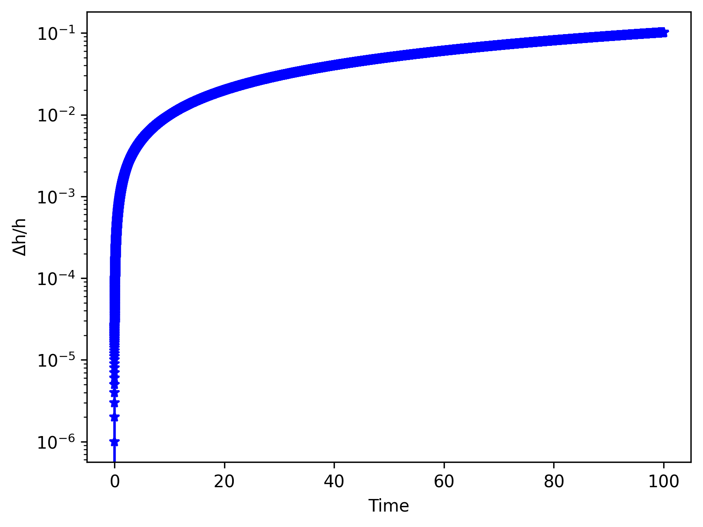

.. _Orbital_Mechanics:

Orbital Mechanics
==================

In this excercise the two-body system of the Sun and Earth is used to compare the results of different integrators. The code is written in code units and therefore the mass of the Sun, :math:`M`, is assumed to be 1, the mass of the Earth, :math:`m`, is :math:`3 \times 10^{-6}`, the gravitational constant :math:`G` is assumed to be 1, and the initial conditions for the position and velocity are given as 3-dimensional vectors on an XY plane. The necessary modules and pamereters can be set as follows:

.. code-block:: python
	
    from AstroDynamics import orbits
    import numpy as np

    #capital letters = SUN, lower case = EARTH
    M, m = 1.0, 3.0e-6

    #Position vectors
    X, x = np.array([0., 0., 0.]), np.array([1., 0., 0.])

    #Velocity vectors
    V, v = np.array([0., 0., 0.]), np.array([0., 1., 0.])
    

where :math:`dt` and :math:`tend` correspond to the timestep and the number of steps to take during the integration, respectively. The orbit object can then be created using the `orbit <https://astro-dynamics.readthedocs.io/en/latest/autoapi/AstroDynamics/orbits/index.html#AstroDynamics.orbits.orbit>`_ class. 

Different integrators are useful for different types of systems. For example, the fourth-order Hermite integrator is optimal for star cluster dynamics while symplectic integrators such as the Wisdom-Holman integrator are often used for secular evolution of planetary systems. **The simplest integrator is the forward Euler integration scheme, which calculates the expected position and velocity of an object by assuming it drifts at a uniform velocity during a small time interval**. 

Euler Integrator
------------------
Below is an example of how to run the Euler integrator using different integration parameters:

.. code-block:: python
	
    #Integration parameters
    dt, tend = 1e-3, 100

    orbit = orbits.orbit(M=M, m=m, X=X, V=V, x=x, v=v, dt=dt, tend=tend, integrator='euler')

The ``plot_orbit`` method plots the position of the star and the planet in the x-y plane. The planet's position is stored in the x_vec and y_vec attributes and the star's position is stored in the X_vec and Y_vec attributes.

.. code-block:: python

    orbit.plot_orbit()

The ``calc_energy`` method calculates the energy of the system given the velocity and position vectors of the two celestial bodies. It calculates the magnitude of the velocity vectors, adds up the kinetic energy of both bodies, and subtracts the potential energy of the two bodies due to their mutual gravitational attraction. The method then saves the ``energy`` attribute which contains an array containing the energy of the system as a function of time. The ``plot_energy`` method can be used to plot the energy error of the system as a function of the integration time steps. 

.. code-block:: python

    orbit.plot_energy()

The ``calc_momentum`` method calculates the angular momentum of the system given the velocity vectors and the separation distance between the two bodies. It uses the x and y components of the velocity vectors of the star, calculates the velocity of the planet relative to the star, calculates the :math:`\phi` angle and angular velocity, and finally computes the angular momentum by multiplying the square of the separation distance and the angular velocity. The ``plot_momentum`` method plots the error in the angular momentum of the system as a function of the integration time steps.

.. code-block:: python

    orbit.plot_momentum()

**We can change the integration parameters and re-configure the model:**

.. code-block:: python

    orbit.dt = 1e-4
    orbit.tend = 1e4
    orbit._run_()

    orbit.path='/Users/daniel/Desktop/'
    orbit.plot_orbit(savefig=True)
    orbit.plot_energy(savefig=True)
    orbit.plot_momentum(savefig=True)

